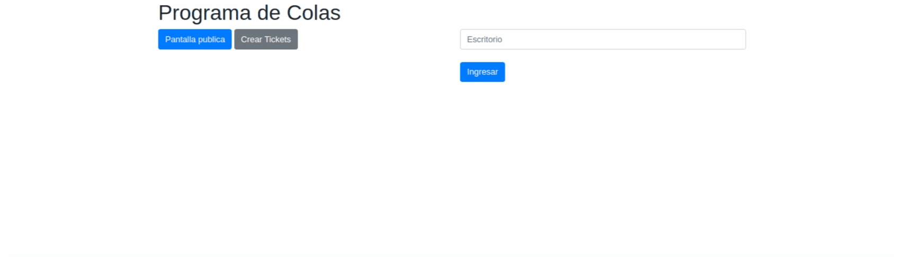
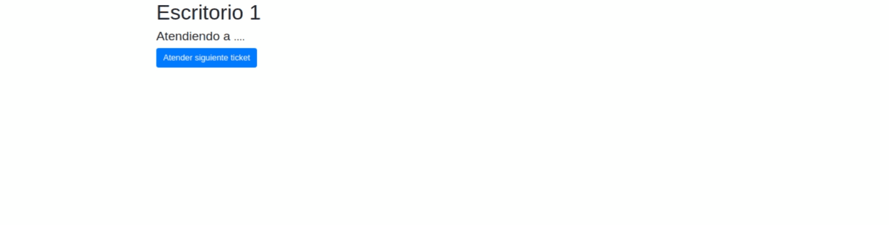
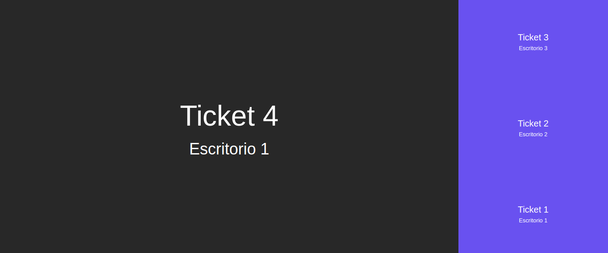

# Modulo-colas 🚀

Aplicacion para control de colas para bancos,farmacias,markets etc..

### Instalación 🔧

primero instalar las dependencias:

```
npm install
```

luego arrancar el servidor con: 

```
npm start
```

Finalmente el servidor corriendo en el puerto 3000 : 

http://localhost:3000/

## Muestras 🤓

menu:



generar tickets (usuario):


atender al siguiente ticket:



vista publica:



